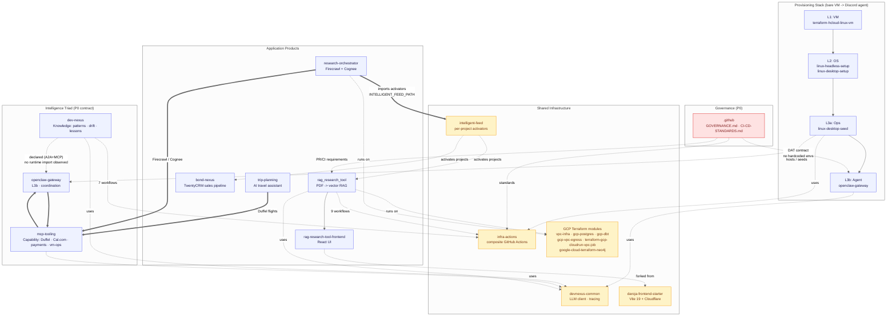

# DarojaAI Org Overview (CTO-facing)

> **Audience:** CTOs, technical leadership, external collaborators.
> **Source of truth:** This is a *summarized view*. The full map lives in [`ARCHITECTURE.md`](../ARCHITECTURE.md); the per-repo inventory is in [`REPOS.md`](../REPOS.md).
> **Last refreshed:** 2026-06-24.

A one-page summary of how the repos in `DarojaAI` fit together, what value each adds, and where the load-bearing contracts are.

---

## TL;DR

The org is organized into **four interlocking stacks** with shared infrastructure cutting across them:

| Stack | Job | Anchor repo |
|---|---|---|
| **Provisioning** | Bare VM → Discord AI agent | `openclaw-gateway` |
| **Intelligence triad** | Knowledge / capability / coordination for AI agents | `dev-nexus` |
| **Application products** | End-user-facing services | `rag_research_tool` |
| **Shared infrastructure** | CI/CD, libraries, GCP modules | `infra-actions` |

Two P0 contracts govern the org: **`.github/GOVERNANCE.md`** (categories, ownership, PR/CI standards) and **`dev-nexus/docs/architecture/architectural-boundaries.md`** (the triad's forcing function). When in doubt, those win.

---

## Diagram

The full Mermaid source is in [`diagrams/org-cto-overview.mermaid`](../diagrams/org-cto-overview.mermaid). Rendered:

**Legend.** Solid arrows are direct code/data flow. Thick `==>` arrows are confirmed runtime/integration dependencies. Dashed `-.->` arrows are "uses / consumed by / seeded by" relationships.

---

## How to read the diagram (the 60-second tour)

1. **Four stacks, four jobs.** Provisioning *builds the host*. The intelligence triad *runs the brain*. Applications *face the user*. Shared infrastructure *serves all of them*.
2. **The provisioning stack is a chain.** L1 (VM) → L2 (OS) → L3a (ops/seed) → L3b (agent runtime). Each layer usable independently; together they turn a bare Hetzner VM into a Discord AI agent.
3. **`openclaw-gateway` wears two hats.** It's both L3b in the provisioning stack *and* the coordination node of the intelligence triad. That intersection is where stacks meet.
4. **The intelligence triad is bounded by contract.** `dev-nexus` (knowledge) → `mcp-tooling` (capability) → `openclaw-gateway` (coordination). The forcing function is "If code in X could live in Y, it belongs in Y." Any drift there is a P0 violation.
5. **Applications consume the triad.** `trip-planning` calls Duffel (via `mcp-tooling`). `research-orchestrator` imports activators from `intelligent-feed` (a Phase 4 Cognee pipeline orchestrator). `rag_research_tool` is the org's flagship product and the most-wired repo.
6. **Shared infrastructure compounds.** `infra-actions` is the CI/CD backbone used by 18 of 41 active repos (~44%). The 56% gap is the largest single CI improvement opportunity in the org.
7. **Governance is the spine.** `.github` feeds the DAT contract (no hardcoded env values) into `openclaw-gateway`; that contract is now confirmed org-wide via `.github/docs/CI-CD-STANDARDS.md` §1.

---

## Stack-by-stack value

### 1. Provisioning Stack — `L1 → L2 → L3a → L3b`

| Layer | Repo(s) | What it adds |
|---|---|---|
| **L1** | `terraform-hcloud-linux-vm` | A versioned, reproducible Hetzner VM (primary path). |
| **L2** | `linux-headless-setup`, `linux-desktop-setup` | Configured OS with dev tooling. Headless for servers; desktop for GUI/RDP. |
| **L3a** | `linux-desktop-seed` | VM ops, deploy orchestration, CI/CD integration. Imports L1 + L2. |
| **L3b** | `openclaw-gateway` | Discord AI agent runtime. Built on OpenClaw. Enforces the DAT contract. |

**Value flow:** each layer lowers the level of effort required to stand up the layer above it. New Discord agents start as a VM and climb the chain. The whole stack is "validated for personal/developer use"; production-readiness is a separate question tracked in `OPEN_QUESTIONS.md`.

### 2. Intelligence Triad — *Knowledge / Capability / Coordination*

The triad's P0 boundary contract lives at [`DarojaAI/dev-nexus/docs/architecture/architectural-boundaries.md`](https://github.com/DarojaAI/dev-nexus/blob/main/docs/architecture/architectural-boundaries.md). Treat it as the spec.

- **`dev-nexus`** (knowledge) — pattern discovery, drift detection, remediation PRs. Owns the contract.
- **`mcp-tooling`** (capability) — MCP servers wrapping external APIs (Duffel, Cal.com, payments) and host ops (vm-ops). Exposes tools to the agent.
- **`openclaw-gateway`** (coordination) — routes, sessions, policy. The runtime that ties them together.

**Value flow:** agents query `dev-nexus` for prior lessons, call `mcp-tooling` for actions, and run under `openclaw-gateway`'s coordination. Cross-contamination is forbidden by contract — if knowledge can answer a query, it stays in knowledge; if a capability exists for an action, it stays in capability.

### 3. Application Products

| Repo | What it does | Wired to |
|---|---|---|
| `rag_research_tool` | PDF → vector RAG. FastAPI + GCP + Atlas + Neo4j. | 9 `infra-actions` workflows · `devnexus-common` · GCP modules |
| `rag-research-tool-frontend` | React UI for above. | Forked from `daroja-frontend-starter` |
| `bond-nexus` | TwentyCRM sales pipeline setup package (60-min quickstart). | Activated by `intelligent-feed` |
| `trip-planning` | AI travel assistant (no README yet; Q11). | `mcp-tooling/duffel` for flights |
| `research-orchestrator` | Research extraction (Firecrawl + Cognee). | `intelligent-feed` activators · GCP modules |

**Value flow:** each app is the user-facing surface of a stack composition. They consume the triad's capability layer and run on shared infrastructure. None of them are independent — they all rely on at least one shared lib.

### 4. Shared Infrastructure

| Repo | What it provides | Used by |
|---|---|---|
| `infra-actions` | Composite GitHub Actions (CI/CD backbone). | 18 of 41 active repos |
| `devnexus-common` | Shared Python (LLM client, tracing). Rename to `py-daroja-libs` queued (Q5). | `dev-nexus`, `mcp-tooling`, `openclaw-gateway`, `rag_research_tool` |
| `intelligent-feed` | Phase 4 Cognee pipeline orchestrator + per-project activators. | `research-orchestrator` (via `INTELLIGENT_FEED_PATH` sys.path injection) |
| `daroja-frontend-starter` | Vite 19 + Cloudflare frontend template. | `rag-research-tool-frontend` (forked from) |
| GCP Terraform modules | Network (`vpc-infra`), Postgres (`gcp-postgres-terraform`), dbt (`gcp-dbt-terraform`), Cloud Run (`terraform-gcp-cloudrun-vpc-job`), Neo4j (`google-cloud-terraform-neo4j`), egress (`gcp-vpc-egress-terraform`). | `rag_research_tool`, `research-orchestrator`, others |

**Value flow:** shared infra amortizes cost across repos. The `infra-actions` consumer ratio (44%) is the clearest single signal of org maturity — every percentage point of adoption is leverage gained.

---

## The two P0 contracts

1. **[`DarojaAI/.github/GOVERNANCE.md`](https://github.com/DarojaAI/.github/blob/main/GOVERNANCE.md)** — categories, ownership, RFC process, PR/CI standards, commit conventions. The org's constitution.
2. **[`DarojaAI/dev-nexus/docs/architecture/architectural-boundaries.md`](https://github.com/DarojaAI/dev-nexus/blob/main/docs/architecture/architectural-boundaries.md)** — the triad's boundary rules. The org's architectural spec.

When this overview conflicts with either contract, **the contracts win**. This doc is a *navigational aid*, not a source of truth.

### Triad wiring status (audited 2026-06-24)

The triad boundary contract defines three systems and a forcing function, but **only one of the three edges is actually wired at runtime** (verified by grepping the source of each repo, not by reading the docs):

| Edge | Status | Evidence |
|---|---|---|
| `openclaw-gateway` → `mcp-tooling` | **Wired (runtime)** | `openclaw-gateway/docs/architectural-boundaries.md:113-241` shows `callTool("mcp-tooling.<server>.<action>")` calls in actual code. Duffel, vm-ops confirmed working. |
| `openclaw-gateway` → `dev-nexus` | Declared (A2A + MCP) | Boundary doc defines `POST /a2a/execute` and `POST /mcp/execute` interfaces (lines 270-282). No import evidence in either repo's source — the wire is *specified*, not *observed*. |
| `dev-nexus` → `mcp-tooling` | Doc-references only | Boundary doc mentions `mcp-tooling` to define *what doesn't belong in `dev-nexus`*. `mcp-tooling/runtime/base.py:4-9` says `BaseTool` shape mirrors `BaseSkill` (parallel design, not a runtime call). No code imports between the two. |

**Read this section as the ground truth**, not the aspirational diagrams in either boundary doc. The triad is a *governance structure* with one runtime implementation; "the intelligence triad" implies more wiring than currently exists.

### Known stale references in the boundary doc

The boundary doc still references archived repos as live consumers. Filed for cleanup:

- **dev-nexus#1168** — remove `dependency-orchestrator` from the A2A consumer list (operator-confirmed dead 2026-06-24). Patch proposed.
- `pattern-miner` is also archived and still listed on line 272 of the boundary doc; flagged in the same issue for the dev-nexus maintainer's decision.

---

## Known gaps (CTO-relevant)

These are tracked in [`OPEN_QUESTIONS.md`](../OPEN_QUESTIONS.md) but called out here because they affect org-wide leverage:

- **CODEOWNERS present in 4/41 active repos** (90% gap, Q6). No enforceable ownership for most repos.
- **`infra-actions` adoption at 44%** (Q7). Largest single CI/CD improvement opportunity.
- **DAT contract enforcement varies.** Defined org-wide, but lint/audit tooling isn't rolled out to non-`openclaw-gateway` repos yet.
- **6 repos with no README** (Q11). Discoverability suffers.
- **`devnexus-common` rename to `py-daroja-libs`** approved but unmerged (Q5). Name implies `dev-nexus` ownership; it's a shared lib.
- **5th governance category "Shared Libraries & Templates"** approved, RFC pending (Q4).
- **`intelligent-feed` shared-lib hardening** (Q15–Q17): no `AGENTS.md`, env-var path coupling, no CI, no LICENSE.

---

## Related

- [`ARCHITECTURE.md`](../ARCHITECTURE.md) — full architectural map (draft v0.1).
- [`REPOS.md`](../REPOS.md) — per-repo inventory with status.
- [`MEMORY.md`](../MEMORY.md) — distilled org knowledge (main session only).
- [`OPEN_QUESTIONS.md`](../OPEN_QUESTIONS.md) — known gaps.
- [`diagrams/org-cto-overview.mermaid`](../diagrams/org-cto-overview.mermaid) — raw Mermaid source for this page.
- [`DarojaAI/.github/GOVERNANCE.md`](https://github.com/DarojaAI/.github/blob/main/GOVERNANCE.md) — the org's constitution.
- [`DarojaAI/dev-nexus/docs/architecture/architectural-boundaries.md`](https://github.com/DarojaAI/dev-nexus/blob/main/docs/architecture/architectural-boundaries.md) — the triad's P0 contract.
