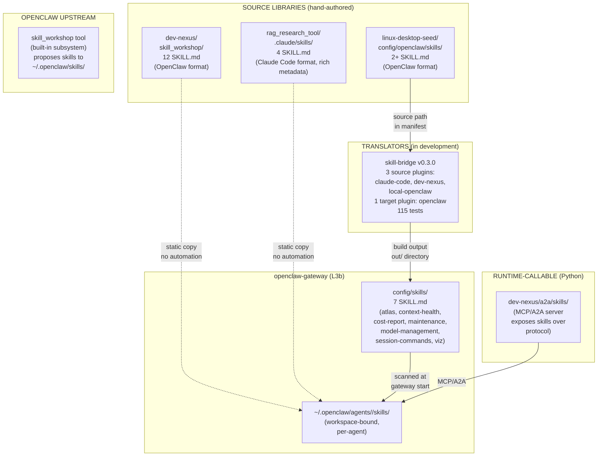
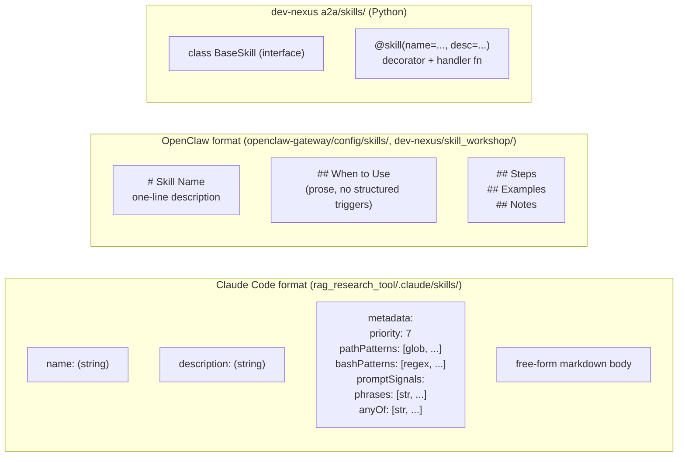
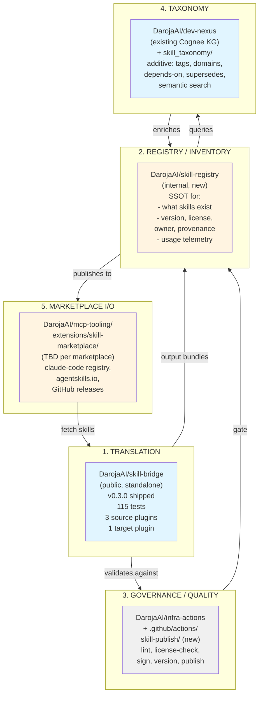
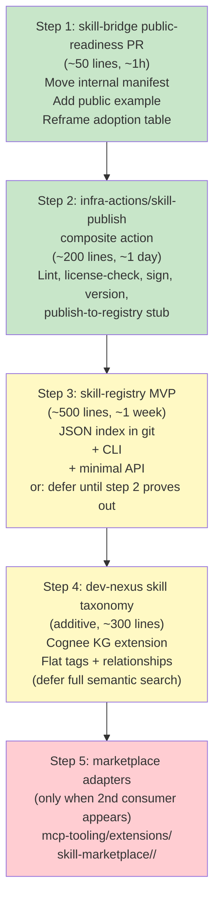

# Skill Ecosystem — Architecture & Roadmap

> **Status:** DRAFT v0.1 — for operator review.
> **Date:** 2026-06-14
> **Repo:** `DarojaAI/darojaai_architect` (this is the canonical planning doc; mirror in `ARCHITECTURE.md` and `MEMORY.md`).
> **Scope:** Org-wide. Spans 5 concerns: translation, registry, governance, taxonomy, marketplace I/O.
> **Source material:** `memory/2026-06-14-skill-bridge-take.md`, `memory/2026-06-14.md` (Q-bridge conversation), live code in `DarojaAI/skill-bridge`, `DarojaAI/dev-nexus`, `DarojaAI/openclaw-gateway`, `DarojaAI/rag_research_tool`, `DarojaAI/mcp-tooling`, `DarojaAI/infra-actions`, and the OpenClaw upstream `skill_workshop` subsystem.

---

## 1. Problem Statement

The DarojaAI org has skills in **5+ locations, in 3+ formats, consumed in 2+ ways**, with **no single source of truth** for what skills exist, where they live, who owns them, or what license applies. The operator wants a unified skill ecosystem that:

- Imports skills from internal repos **and external marketplaces** (Claude Code plugin registry, agentskills.io, GitHub).
- Translates between formats (Claude Code, dev-nexus, OpenClaw, and future targets).
- Tracks skills: inventory, version, license, ownership, provenance, quality signals.
- Deploys to consumers (openclaw-gateway, third-party agents).
- Maintains a taxonomy for discovery and relationship queries.
- Enforces governance: lint, sign, approve, deprecate.
- Is public-ready (skill-bridge itself is intended for public release).

This document proposes a 5-subsystem architecture, lays out options for each, and calls out the risks of the recommended path.

---

## 2. Current State (as of 2026-06-14)

### 2.1 Where skills live today

**Key facts:**
- **No registry** — the truth is `grep "SKILL.md" _context/*/.claude/skills/ _context/*/config/skills/ _context/*/skill_workshop/`.
- **No automation** — the dashed lines in the diagram are copy-paste or `git mv`, not pipelines.
- **No shared taxonomy** — categories, tags, and relationships between skills are implicit in folder names.
- **Two competing "skill_workshop" concepts** — OpenClaw upstream's `skill_workshop` tool (proposal-based skill creation) and `dev-nexus/skill_workshop/` (a static folder of skill content). They share a name; they are not the same thing.
- **Two skill paths in dev-nexus** — `dev-nexus/skill_workshop/` (SKILL.md files, hand-authored) and `dev-nexus/a2a/skills/` (Python, served over MCP/A2A). The first is content for other agents; the second is callable from openclaw-gateway.

### 2.2 Format inventory

**Critical gap:** Claude Code's `metadata` block has machine-readable trigger conditions (path globs, bash patterns, prompt phrases, priority). OpenClaw's prose-only `## When to Use` does not. **Translation CC → OpenClaw is lossy** — the metadata-rich triggers are dropped, and the human-written prose is preserved. This is a design issue for skill-bridge to fix.

### 2.3 The dev-nexus `skill_workshop/` naming trap

Per OpenClaw upstream docs (`/usr/lib/node_modules/openclaw/docs/tools/skill-workshop.md`):

> Skill Workshop writes workspace skills only. It does not mutate bundled, plugin, ClawHub, extra-root, managed, personal-agent, or system skills.

The `skill_workshop` tool is a **proposal-and-apply lifecycle for workspace skills** — agents and operators don't write `SKILL.md` directly through this path, they create a `PROPOSAL.md` first, then apply it. The applied skill lands in `~/.openclaw/skills/<name>/SKILL.md`.

The `dev-nexus/skill_workshop/` folder **is not** the output of the `skill_workshop` tool. It is a hand-curated library of skill *content*, named for historical reasons, intended to be read by humans or copied manually into workspace skills.

**This is a documentation/architecture trap.** Anyone reading `dev-nexus/skill_workshop/` and the OpenClaw docs will reasonably assume the folder is the workshop's output. It is not. This needs a name change in dev-nexus (Q-A, see §6.1).

---

## 3. Proposed Architecture: 5 Subsystems

**The principle:** one concern per subsystem, similar to the existing intelligence triad (`dev-nexus` / `mcp-tooling` / `openclaw-gateway` with a P0 contract). Same pattern, applied to skills.

### 3.1 Subsystem 1: Translation (DarojaAI/skill-bridge)

**Status:** v0.3.0 shipped. Real, tested, working.

**Public or internal:** **Public.** skill-bridge is intended for public release. The maintainer (Milan Patel) is also a future user of the larger ecosystem; building the public product first validates the translator shape before opening the registry and governance pieces.

**What it does:** translate a `SKILL.md` from one format to another via a plugin IR (`SkillIR` in `src/plugins/interfaces.ts`).

**What it doesn't do (yet):**
- Multi-target builds (Phase 6 of `docs/ARCHITECTURE.md` in skill-bridge; not started). Today: one target = openclaw.
- Lossless CC → OpenClaw translation. Today: metadata fields are dropped, prose is preserved.
- Public release polish. The shipped `skill-bridge.manifest.json` references 2 PROPRIETARY Milan-owned skills — that's an internal deploy manifest, not a public example.

**Owner:** Milan (maintainer). Architectural review: `darojaai_architect`.

### 3.2 Subsystem 2: Registry / Inventory (DarojaAI/skill-registry, new)

**Status:** Does not exist. The closest analog is `dev-nexus`'s Cognee KG, but that's a *knowledge* store, not a *skill* store.

**Public or internal:** Internal (for now). Could go public later if the org wants to host a public skill catalog.

**What it would do:**
- Single source of truth: skill id, version, source path, target, license, owner, provenance hash, publish date.
- API: `GET /skills/<id>`, `GET /skills?domain=...`, `GET /skills/<id>/versions`.
- CLI: `skill-registry search`, `skill-registry info <id>`, `skill-registry publish` (writes only; read-only by default).
- Storage: probably a JSON index in git + a small API server, or a flat-file registry with content hashes (à la npm or Homebrew formulas). **No database needed at this scale** (8 known skills, 4 repos).

**Why a new repo, not dev-nexus:** dev-nexus is **knowledge** (patterns, lessons, drift) per the P0 contract. A skill registry is **inventory** (records, versions, lookups). Different concern, different home. But dev-nexus is the natural *consumer* of the registry — the taxonomy subsystem (3.4) reads the registry to build the KG.

### 3.3 Subsystem 3: Governance / Quality (DarojaAI/infra-actions, additive)

**Status:** infra-actions has 4 composite actions (setup-node, setup-python, setup-terraform, setup-gcloud). None for skills.

**Public or internal:** **Internal.** Standards and CI live here, not in public-facing tools.

**What it would do:** add `.github/actions/skill-publish/` as a composite action that:
1. Lints the SKILL.md (required sections, no broken links, no hardcoded secrets).
2. License-checks (SPDX, copyright holder, file reference).
3. Hashes content (lockfile comparison).
4. Validates against the registry (no duplicate ids, version monotonic).
5. Signs (GPG or Sigstore cosign).
6. Publishes to the registry.

**Why infra-actions, not a new repo:** the org already converges on infra-actions (18 of 41 active repos use it; Q7). Adding a 5th composite action follows the established pattern. New repo would be the `devnexus-common` problem in a different shape.

### 3.4 Subsystem 4: Taxonomy (DarojaAI/dev-nexus, additive)

**Status:** dev-nexus has a Cognee KG, used today for code patterns and lessons. No skill taxonomy yet.

**Public or internal:** **Internal.** Stays consistent with dev-nexus's existing scope.

**What it would do:** add a `skill_taxonomy/` additive content type to the Cognee KG:
- **Tags:** `domain:data-contracts`, `domain:kg`, `domain:cost`, etc.
- **Relationships:** `depends-on:<other-skill>`, `supersedes:<old-skill>`, `conflicts-with:<other-skill>`.
- **Discovery:** "find all skills related to data contracts" → semantic search via Cognee.

**Why dev-nexus, not a new repo:** the org already pays for the Cognee infrastructure in dev-nexus. Adding a new content type is cheaper than standing up a separate KG. And the P0 contract already routes "what patterns exist" questions to dev-nexus; "what skills exist" is the same shape of question.

**Risk:** if dev-nexus's Cognee pipeline is fragile or slow, adding skill data could regress it. Need to confirm Cognee can handle 100s of skill entities without performance issues. (8 skills today is trivially fine; 100s is the worry.)

### 3.5 Subsystem 5: Marketplace I/O (DarojaAI/mcp-tooling/extensions/skill-marketplace/, TBD)

**Status:** Does not exist. The closest analog is the dev-nexus MCP server, which exposes skills over protocol.

**Public or internal:** Depends on the marketplace. Some marketplaces (agentskills.io, Claude Code plugin registry) will require public mcp-tooling packages; others (internal-only) stay private.

**What it would do:** adapters per marketplace, with a shared interface:
- `claude-code-registry` adapter: pull skills from `~/.claude/plugins/cache`, push to a CC-compatible registry.
- `agentskills-io` adapter: pull from agentskills.io's public catalog.
- `github-releases` adapter: pull SKILL.md from GitHub release artifacts.

**Why mcp-tooling, not a new repo:** the I/O layer is the same shape as mcp-tooling's other adapters (Duffel, Cal.com, payments) — wrap an external API, expose it as a callable tool. Pattern fits. The "extension" subdirectory of mcp-tooling is the natural home for marketplace-specific packages.

**Caveat:** this subsystem is **speculative** until there's a second consumer type wanting skills from outside the org. Don't build adapters in advance.

---

## 4. Options for the Translator's Home

The question of "where should `skill-bridge` sit relative to other repos" has 3 plausible answers. Below: each option, what it requires, what it enables, and the risks.

### Option A: `skill-bridge` as a build tool in `infra-actions` ❌ rejected

**What:** Fold `skill-bridge` into `infra-actions/.github/actions/skill-bridge/` as a composite action. Archive the standalone repo.

**Why it would be right:**
- infra-actions is the CI/CD backbone (18 of 41 active repos). Skill deployment *is* a CI/CD concern.
- The output (`config/openclaw/skills-built/`) is runtime config on a VM, not a library other repos import.
- The plugin IR is overkill for the current single target.

**Why it was rejected (operator decision 2026-06-14):** the maintainer wants `skill-bridge` to be a **public product**. infra-actions is **inherently internal**. Folding a public-shaped tool into an internal repo kills the public release.

**Risk if revisited:** the public release fails because infra-actions doesn't have a public release story, and pulling one piece out of a tightly-coupled monorepo is a 6-month project.

### Option B: `skill-bridge` as standalone, public, ready for public release ✅ recommended (current state, with hygiene work pending)

**What:** keep `DarojaAI/skill-bridge` as a standalone public repo. Do the public-readiness hygiene pass: move the internal `skill-bridge.manifest.json` to `examples/private-deployment-manifest.json`, add `examples/basic-public-manifest.json` using the superpowers fixture, reframe the "Who is using skill-bridge" table to be public-readable.

**Why it's right:**
- The repo is real (v0.3.0, 3 releases, 115 tests, working plugin IR).
- The plugin IR was the right design for *future* multi-target; paying for it now is fine because the maintainer is also a user.
- The public release is independently valuable — the translator is useful even if the larger ecosystem (registry, governance, taxonomy) never materializes.

**What it requires:**
- A `chore: public-readiness` PR in `skill-bridge`. ~50 lines of changes, ~1 hour of work, no behavior changes.
- A decision on the public release timing (drives how aggressive the README polish is).
- A decision on the marketplace scope (drives Phase 6 design — multi-target build pipeline).

**Risk:**
- **The repo is dead on arrival as public** if the public-readiness pass is skipped. The shipped `skill-bridge.manifest.json` references 2 PROPRIETARY Milan-owned skills. That's a private deployment manifest, not a public example. A first-time visitor will be confused.
- **The maintainer (Milan) is the only consumer** today. Public release with one user looks thin. Mitigation: the public-readiness PR should not over-promise; the adoption table is honest ("In use"/"Plugin in progress"/"Working") which is good.

### Option C: `skill-bridge` as a catalog/runtime service ❌ rejected (YAGNI)

**What:** build a "skill catalog" service that discovers, versions, installs, and serves skills to any consumer in the org. Like a private npm registry for SKILL.md.

**Why it would be right at scale:** the question of "import, cataloguing, deployment" points at a catalog service. A registry is the answer to "I have 8 skills in 4 places and I want to find them all, know which version, and use them anywhere."

**Why it was rejected (YAGNI):**
- 8 known skills across 4 repos does not justify a registry service.
- The cost of a registry API + versioning scheme + install protocol + UI/CLI + maintenance burden is real.
- The same problem is solved today by `ls .claude/skills/` and `git grep "name:" SKILL.md`.
- A catalog service is *infrastructure for an ecosystem that doesn't exist yet*. Build the ecosystem first (Option B), then decide if a catalog is needed.

**When to revisit:** the moment the org has 50+ skills, 5+ consumers, and a real "give me the latest version of X" use case. Until then, the registry is Subsystem 2 (§3.2), but it's a 2-month deferred build, not the first thing.

### Option comparison matrix

| | Option A: fold into infra-actions | Option B: standalone public | Option C: catalog service |
|---|---|---|---|
| **Public release** | ❌ impossible (infra-actions is internal) | ✅ possible (intended) | ❌ possible but premature |
| **Solves operator's "build for me"** | ✅ yes | ✅ yes | ✅ yes |
| **Solves operator's "bridge the world"** | ❌ no | ✅ yes (with Phase 6) | ✅ yes (but overkill) |
| **Build cost now** | Low (move + subtree) | Low (~1h public-readiness PR) | High (months of work) |
| **Maintenance cost** | Low (one less repo) | Medium (release cadence) | High (service + storage) |
| **YAGNI risk** | None | Low | High |
| **Lock-in** | None (could extract later) | None (could fold later) | None (but big sunk cost) |

**Recommendation: Option B.** Standalone public, with the public-readiness PR as the next concrete step.

---

## 5. Risks of the Recommended Path

### 5.1 Risk: skill-bridge public release fails because it's single-consumer

**Severity:** Medium. **Likelihood:** Medium.

The maintainer is the only production user today. Public release with one user looks thin. Mitigation: the public-readiness PR is honest about this in the "Who is using skill-bridge" table. Don't over-promise. The superpowers fixture (`tests/fixtures/superpowers-vendored/`) is a legitimate example of "what bridging looks like in practice."

### 5.2 Risk: the registry, governance, and taxonomy subsystems never get built

**Severity:** High. **Likelihood:** Medium.

The "build for me first, then expand" plan assumes the operator will return to the registry, governance, and taxonomy work after the public-release PR. If they don't, the org ends up with:
- A public skill-bridge (good)
- 8 skills in 4 repos, still managed by grep (no progress on the inventory problem)
- No governance, no quality control, no taxonomy

**Mitigation:** treat the public-readiness PR as the **last** step of a 3-step plan: (1) public-readiness PR, (2) registry MVP, (3) governance pipeline. The plan is short enough that deferral is a real risk; the operator should commit to at least step 2 before moving on to other work.

### 5.3 Risk: CC → OpenClaw translation is lossy, breaking "smart" skills

**Severity:** Medium. **Likelihood:** High (it's already happening).

The Claude Code metadata block (priority, path patterns, bash patterns, prompt signals) is more useful for "when to use" detection than the human-written OpenClaw prose. When skill-bridge translates CC → OpenClaw today, it drops the metadata and keeps the prose. The resulting OpenClaw skill is harder to auto-trigger.

**Mitigation:** the skill-bridge Phase 6 work (multi-target) should include a metadata-preservation strategy. One option: keep the CC metadata as a sidecar JSON file alongside the OpenClaw SKILL.md, and have openclaw-gateway read both. Another option: extend the OpenClaw SKILL.md frontmatter to support CC-style fields.

**Not blocking the public-readiness PR** — this is a known limitation that can be fixed in v0.4.0 or later.

### 5.4 Risk: dev-nexus `skill_workshop/` folder name is misleading

**Severity:** Low. **Likelihood:** High (already happening).

Per §2.3, the `skill_workshop/` folder in dev-nexus is misnamed — it shares a name with OpenClaw's built-in `skill_workshop` tool but is unrelated to it. New contributors will be confused.

**Mitigation:** rename the folder in dev-nexus to `skills/library/` (or just `skills/`). Add a README in the folder explaining what it is. **Pre-condition for any new skill consumer that uses dev-nexus as a source** — otherwise the consumer's source path will reference a misnamed folder.

**Independent of the skill-bridge work.** This is a separate hygiene task in dev-nexus.

### 5.5 Risk: marketplace adapters are built before they're needed

**Severity:** Low. **Likelihood:** Medium.

It's tempting to start building `mcp-tooling/extensions/skill-marketplace/claude-code-registry/` as a "natural next step." It's not. The org has no second consumer type yet. Building the adapter before the consumer means building for a hypothetical use case.

**Mitigation:** don't build Subsystem 5 (marketplace I/O) until a concrete second consumer materializes. If/when someone outside the org asks "how do I get skills from your registry," *that's* the trigger.

### 5.6 Risk: dev-nexus Cognee pipeline is fragile or slow at scale

**Severity:** Medium. **Likelihood:** Low (at 8 skills) → Medium (at 100s of skills).

If the taxonomy subsystem adds skill entities to the Cognee KG, and the pipeline is fragile, adding skills could break the existing pattern-extraction pipeline. At 8 skills this is trivially fine. At 100s, it's worth measuring.

**Mitigation:** add skill entities to the KG **incrementally** (10 at a time, observe), and add a load test before scaling past 50.

### 5.7 Risk: the 5-subsystem architecture is over-engineered for 8 skills

**Severity:** Low. **Likelihood:** Low (subsystems are independently useful).

The 5 subsystems are:
1. Translation (shipped, working)
2. Registry (deferred — not yet built)
3. Governance (deferred — only the composite action needs building)
4. Taxonomy (deferred — additive to existing Cognee)
5. Marketplace I/O (deferred — only when needed)

Building all 5 now would be over-engineering. Building them incrementally as the org grows is fine. The risk is *not* the architecture — it's the assumption that all 5 will be needed. If only 1, 2, and 3 materialize, that's a complete ecosystem. 4 and 5 are speculative.

---

## 6. Open Questions (need operator input)

### 6.1 dev-nexus `skill_workshop/` folder rename

Should the folder be renamed to `skills/library/` or `skills/`? This is a hygiene task in dev-nexus, independent of skill-bridge, but it affects any consumer that references the path.

### 6.2 Public release timing for skill-bridge

Is there a date, event, or external commitment driving the public release? Or is it "someday when it's ready"? Affects how aggressive the README polish is in the public-readiness PR.

### 6.3 Marketplace scope (for Phase 6 multi-target work)

Which marketplaces are in scope?
- Claude Code plugin registry
- agentskills.io
- GitHub releases
- Internal-only skill server
- Others?

This affects Phase 6 design but not the public-readiness PR.

### 6.4 Taxonomy scope

What does "taxonomy" mean for this org?
- **(a) Flat tags + categories** — in-registry, simple, no KG needed.
- **(b) Small ontology of skill relationships** (depends-on, supersedes, conflicts-with) — small KG extension, additive to dev-nexus.
- **(c) Full semantic search via Cognee** — bigger KG work, only if (a) and (b) prove insufficient.

**Recommendation:** start with (a) and (b). Defer (c) until proven necessary.

### 6.5 Order of work after public-readiness

What's the next concrete deliverable?
- (a) skill-registry MVP (most operators find this most painful — no SSOT for skills)
- (b) infra-actions/skill-publish composite action (governance, enables safe public release)
- (c) dev-nexus `skill_workshop/` rename + Cognee taxonomy (hygiene + discovery)

**Recommendation:** (b) first. The skill-publish action is the governance gate that protects the public release from accidental license leakage, broken links, or unsigned content. The registry and taxonomy can come after.

---

## 7. Recommended Path Forward

**Green = next 30 days. Yellow = 30-90 days. Red = speculative, build when needed.**

**Concrete next action:** Step 1, the `chore: public-readiness` PR in `DarojaAI/skill-bridge`. Drafted by `darojaai_architect` when the operator gives the green light and answers Q6.1–Q6.2 (folder rename decision + public release timing).

---

## 8. Related

- `memory/2026-06-14-skill-bridge-take.md` — the deep-read of skill-bridge that this doc builds on
- `memory/2026-06-14-q13-take.md` — Q13 sweep results; skill-bridge issue triage
- `ARCHITECTURE.md` — org map (this doc's home in the model)
- `MEMORY.md` — load-bearing facts; the 5-subsystem split and the `-1` suffix convention
- `OPEN_QUESTIONS.md` — the original Q5–Q17 that this doc consolidates
- `DarojaAI/dev-nexus/docs/architecture/architectural-boundaries.md` — P0 contract for the intelligence triad; same pattern is proposed for skills
- `/usr/lib/node_modules/openclaw/docs/tools/skill-workshop.md` — OpenClaw upstream's `skill_workshop` tool; the dev-nexus `skill_workshop/` folder name trap is documented there
